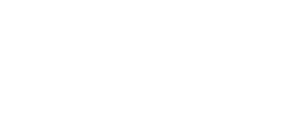
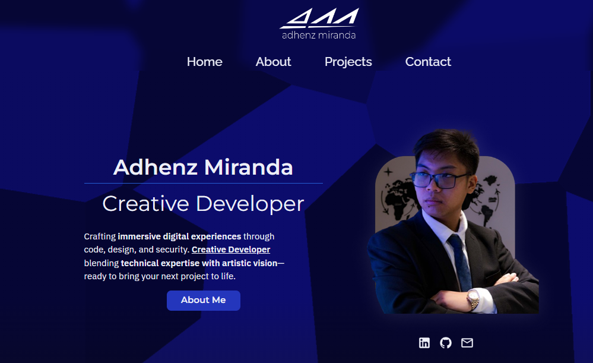
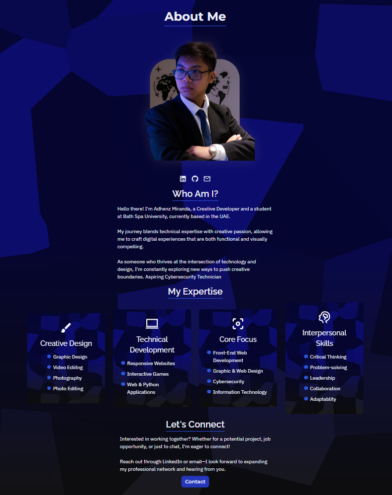
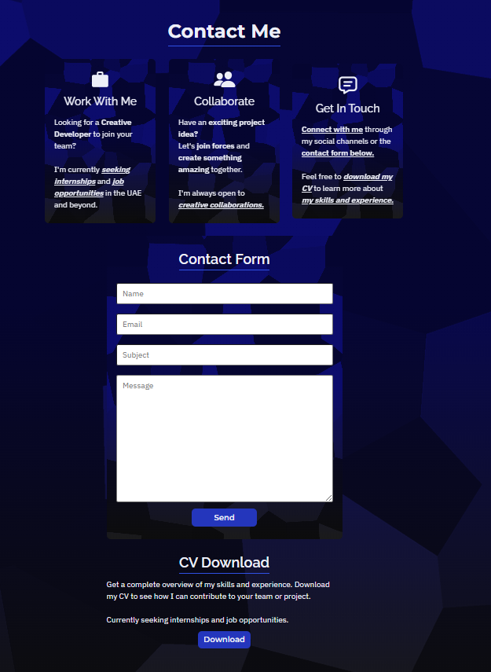
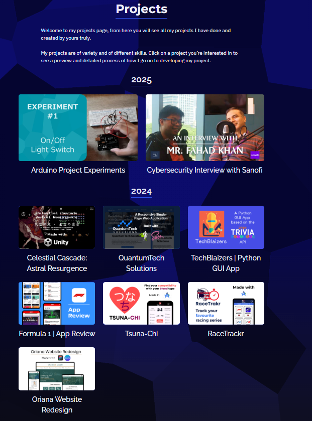
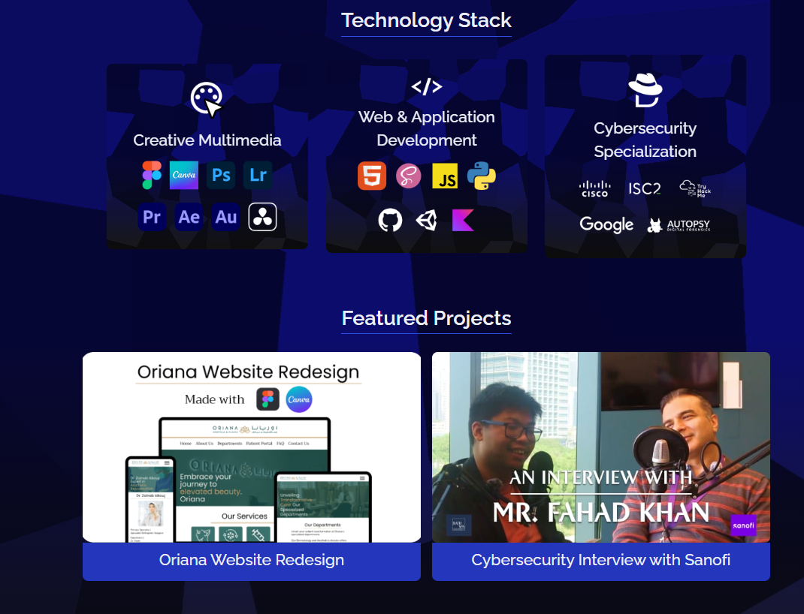

# 🎨 AM Portfolio Website

A modern, responsive portfolio website built with Django and SCSS, showcasing the projects, skills, and professional journey of yours truly, Adhenz Miranda.



---

## ✨ Features

- **Responsive Design**: Mobile-first approach with custom breakpoints and adaptive layouts
- **Modern UI**: Custom SCSS architecture with smooth GSAP animations
- **Django Backend**: Robust backend with REST API support and admin customization
- **Project Showcase**: Featured projects carousel on homepage with dynamic ordering
- **Advanced Media Management**:
  - Photo galleries with thumbnail previews
  - Video uploads with compression tracking
  - Social media embeds (Instagram, Reddit, LinkedIn, Facebook)
  - Lightbox/carousel viewer for fullscreen media browsing
- **Dynamic Category System**: Database-driven categories with admin interface for easy management
- **Custom Error Pages**: Branded 403, 404, and 500 error pages with http.cats integration
- **Contact Form**: Backend-integrated contact system
- **Downloadable CV**: Easy access to professional resume
- **Enhanced Admin Panel**:
  - Visual thumbnail previews for photos and videos
  - Bulk upload capabilities
  - Inline editing for project media
  - Compression quality tracking for videos
- **iOS Compatibility**: Blend mode detection for Safari support
- **Accessible & SEO-Friendly**: Semantic HTML and optimized meta tags

---

## 🛠️ Tech Stack

**Frontend:**

- HTML5, SCSS/CSS3 (modular architecture with components, layouts, and pages)
- JavaScript (ES6+ with GSAP animations)
- Custom lightbox/carousel component for media viewing

**Backend:**

- Django 5.x
- Django REST Framework
- SQLite (development) / PostgreSQL (production-ready)
- Cloudinary integration for media storage
- Custom admin interface with enhanced features

**Other Tools:**

- Cloudinary (image hosting)
- Node.js & npm (for SCSS compilation)
- Git & GitHub
- Visual Studio Code

---

## 📦 Project Structure

```
am-portfolio-website/
├── static/           # Static assets
│   ├── assets/       # Images, icons, tech stack logos
│   ├── css/          # Compiled CSS
│   ├── scss/         # SCSS source files (components, layouts, pages)
│   └── js/           # JavaScript files and components
├── templates/        # Django HTML templates
├── projects/         # Django app: models, views, admin, serializers
│   ├── models.py     # Project, Category, ProjectPhoto, ProjectVideo, ProjectEmbed
│   ├── admin.py      # Custom admin with inline editors and previews
│   ├── views.py      # View functions with project ordering
│   └── migrations/   # Database migrations
├── media/            # User-uploaded media (Cloudinary integration)
├── manage.py         # Django management script
└── README.md         # Project documentation
```

---

## 🚀 Getting Started

### Prerequisites

- Python 3.10+
- Node.js & npm

### Installation

1. **Clone the repository:**

   ```sh
   git clone https://github.com/adhenzmiranda/am-portfolio-website.git
   cd am-portfolio-website
   ```

2. **Create and activate a virtual environment:**

   ```sh
   python -m venv venv
   # On Windows:
   venv\Scripts\activate
   # On macOS/Linux:
   source venv/bin/activate
   ```

3. **Install Python dependencies:**

   ```sh
   pip install -r requirements.txt
   ```

4. **Install Node.js dependencies (for SCSS):**

   ```sh
   npm install
   ```

5. **Compile SCSS:**

   ```sh
   npm run scss
   ```

   Or to watch for changes:

   ```sh
   npm run scss:watch
   ```

6. **Apply migrations and run the server:**
   ```sh
   python manage.py migrate
   python manage.py runserver
   ```

---

## 🖼️ Screenshots







---

## 🎨 Design & UX

- **Clean & Modern Interface**: Minimalist design with focus on content
- **Featured Projects Carousel**: Auto-rotating showcase on homepage
- **Lightbox Media Viewer**: Fullscreen carousel for browsing project media (photos, videos, embeds)
- **Project Detail Pages**:
  - Comprehensive project information with markdown support
  - Technology stack visualization with icons
  - Video galleries with compression info
  - Social media embed support
  - Photo galleries with captions
- **Dynamic Navigation**: Mobile-responsive navbar with animated toggle
- **Technology Stack Section**: Visual representation of skills and tools
- **Custom Error Pages**: Branded error handling with personality
- **Contact & CV Sections**: Easy ways to get in touch or download resume

---

## 📄 License

The source code for this website is licensed under the [MIT License](LICENSE).

All content (text, images, etc.) is © Adhenz Miranda and may not be used without permission.

---

## 📞 Contact

**Adhenz Miranda**  
[adhenz.miranda@gmail.com](mailto:adhenz.miranda@gmail.com)  
[LinkedIn](https://linkedin.com/in/am04)  
[Portfolio Live](https://am04-c1eccbd13c2a.herokuapp.com/)

---

Made with ❤️ by Adhenz Miranda | AM04 Digital
